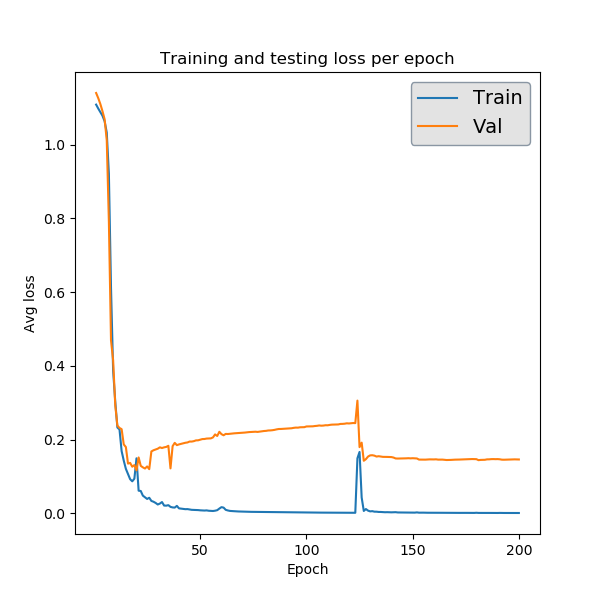
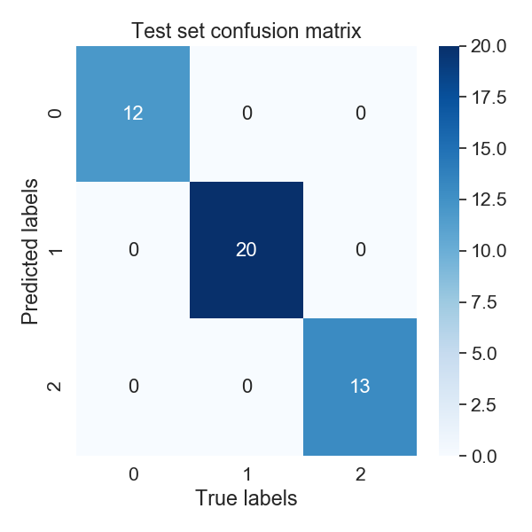
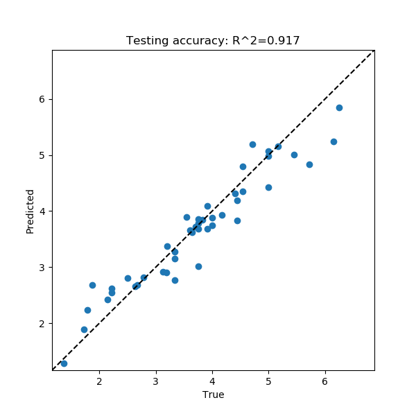
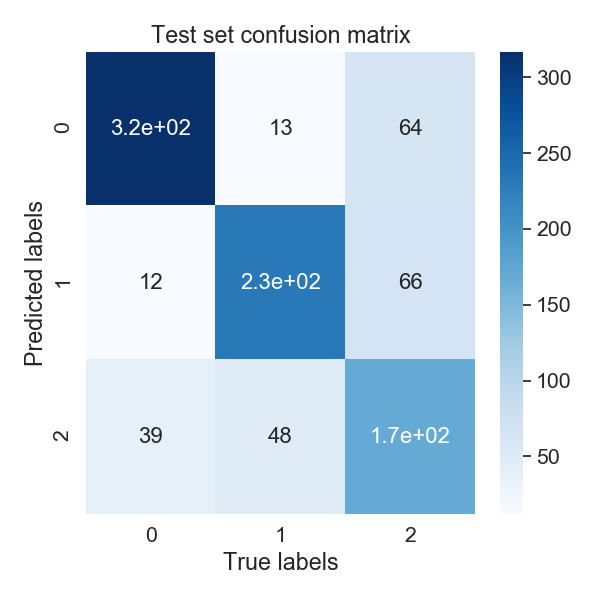
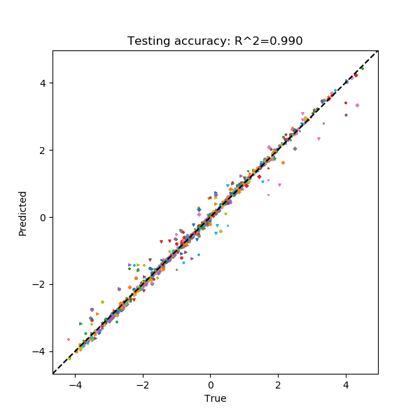

=================
 Basic Examples:
=================

Below are a handful of examples outlining how to apply PARROT to various machine learning tasks. Provided in the PARROT distribution on GitHub is a **/data** folder which contains several example datasets (If you installed via pip you will need to download these files from GitHub). Among these, there are datasets with different data types (sequence-mapped values and residue-mapped values) and for different machine learning task (classification and regression). Read the README within this folder for more details on how to format PARROT datasets and on the particulars of these datasets. This folder also contains an example list of sequences for ``parrot-predict``, and the other files that are used in these examples.

parrot-train
============

**Sequence classification:**

In our first example, each of the 300 sequences in *seq_class_dataset.tsv* belongs to one of three classes:

.. code-block:: bash

    Frag0 WKHNPKHLRP 0
    Frag1 DLFQDEDDAEEEDFMDDIWDPDS 1
    Frag2 YHFAFTHMPALISQTSKYHYYSASMRG 2
    Frag3 CNRNRNHKLKKFKHKKMGVPRKKRKHWK 0
    ...
    Frag296 PDPLAMEDEVESHMEWCNRTHNRKG 2
    Frag297 IWKYTHRSKACMHPH 0
    Frag298 EDDEDVDENEEDDEDEEDNEEDPIE 1
    Frag299 GEPCWVPYDIAQSADRMFFDKAMR 2

Let's train a network with ``parrot-train`` that learns how to classify sequences into these three data classes. Details on running the ``parrot-train`` command can be be found on its specific documentation page. For starters, we won't worry about the network hyperparameters and we'll just use the default values. In the most basic use case, all we need to provide is the datafile, the location where we want to save the trained network, and some basic information about what kind of network we are training. Here, since we are predicting only one value per sequence, we will indicate that the datatype is "sequence". We also will indicate how many data classes there are, which is '3' in this case.

.. code-block:: bash

    parrot-train data/seq_class_dataset.tsv seq_class_network.pt --datatype sequence --classes 3

Training has a stochastic component, so running this multiple times will yield slightly different results. The output to console should look something like:

.. code-block:: bash

    #############################################
    WARNING: Batch size is large relative to the number of samples in the training set.

    This may decrease training efficiency.

    #############################################

    PARROT with user-specified parameters
    -------------------------------------
    Validation set loss per epoch:
    Epoch 0 Loss 1.0972
    Epoch 5 Loss 1.0831
    Epoch 10    Loss 1.0446
    Epoch 15    Loss 0.8525
    Epoch 20    Loss 0.6279
    Epoch 25    Loss 0.3620
    Epoch 30    Loss 0.2419
    Epoch 35    Loss 0.2805
    Epoch 40    Loss 0.2273
    Epoch 45    Loss 0.1774
    Epoch 50    Loss 0.2103
    Epoch 55    Loss 0.1682
    Epoch 60    Loss 0.1524
    Epoch 65    Loss 0.1488
    Epoch 70    Loss 0.1498
    Epoch 75    Loss 0.1464
    Epoch 80    Loss 0.1448
    Epoch 85    Loss 0.1564
    Epoch 90    Loss 0.1593
    Epoch 95    Loss 0.1581

    Test Loss: 0.1507
    
First we notice that there is a message warning us that our batch size is too large. This isn't super problematic and we can ignore it for now. In future runs, we will decrease our batch size using the ``--batch`` flag (by default it's set to 32, which is pretty large relative to our dataset of only 300 sequences). Also note that you can explicitly hide warning messages with the ``--ignore-warnings`` flag.

Turning to the actual training results, we can see that our validation set loss decreases for a while, then plateaus around 0.14-0.15. This is pretty typical, generally this loss will decrease up to a certain point, then start to increase as the network begins to overfit on the training data. Don't worry about this overfitting, since the final network that PARROT returns will be from the iteration that produced the lowest validation set loss.

If you look in the current directory, you should also see three files: our trained network "seq_class_network.pt", a predictions file "seq_class_network_predictions.tsv", and a performance stats summary file "seq_class_network_performace_stats.txt". The network file can be used to make predictions on new sequences with ``parrot-predict`` but is not readable by eye. The second file is a bit more interesting to look at:

.. code-block:: bash

    Frag1_TRUE DLFQDEDDAEEEDFMDDIWDPDS 1
    Frag1_PRED DLFQDEDDAEEEDFMDDIWDPDS 1
    Frag20_TRUE SWQIHMPQWQCKHDMIQWLGDDAQ 2
    Frag20_PRED SWQIHMPQWQCKHDMIQWLGDDAQ 2
    Frag21_TRUE HQPKRKHHHYQHARHHHHKRVH 0
    Frag21_PRED HQPKRKHHHYQHARHHHHKRVH 0
    ...
    Frag273_TRUE LLHRHRFQRSTKRHLLK 0
    Frag273_PRED LLHRHRFQRSTKRHLLK 0
    Frag286_TRUE DDEDEDYWNEWEETEEIQESE 1
    Frag286_PRED DDEDEDYWNEWEETEEIQESE 1
    Frag299_TRUE GEPCWVPYDIAQSADRMFFDKAMR 2
    Frag299_PRED GEPCWVPYDIAQSADRMFFDKAMR 2

**NOTE: Your file will have the same general format, but with different sequences.** These sequences are the ones that were randomly held out as a test set during the training of our network. After the network concluded training, the best-perfoming network (on the validation set) was applied to these test set sequences. **By analyzing this file, we can get an approximation of how well our network would perform on sequences it has not seen before.** This approximation may not hold in every case, but sometimes, it's the best we can do (see "Machine Learning Resources" for more info). In our case, it seems as if our network did a good job at predicting these test set sequences.

The performance stats file is an extension of these test set predictions:

.. code-block:: bash

    Matthews Correlation Coef : 1.000
    F1 Score : 1.000
    Accuracy : 1.000

This file quantifies performance on the test set using a variety of different metrics, which vary between classification and regression tasks. For classification, as shown here, this file reports on the accuracy, F1 score and MCC of our predictions. You can always prevent this file from being output by providing the ``--no-stats`` flag. See "Machine Learning Resources" (or Google!) for more information on how to interpret these metrics.

...............................................................................

Let's demonstrate a few more features of PARROT by training another network. In this run, we'll decrease the ``--batch`` parameter to '8' to get rid of the warning. A smaller batch size will cause the network to update more often during training, which means that training will take longer overall, but the network will learn more each epoch.

Additionally, we will also modify the training time with the ``--epochs`` flag. In the context of machine learning, an epoch is one "round" through the entire training set. By default, PARROT trains for 100 epochs, which means that a network will be exposed to every sequence in the training set 100 times. It's often necessary to increase this parameter to ensure that the network learns the data to its maximum potential.

The remaining two flags we will add are ``--verbose`` and ``--include-figs``. "Verbose" simply causes the output to terminal to be more descriptive, printing the training results after every epoch instead of every 5. As the name suggests, "include-figs" will cause PNG images to be output into the same directory that we are saving the network.

.. code-block:: bash

    parrot-train data/seq_class_dataset.tsv seq_class_network.pt --datatype sequence --classes 3 --batch 8 --epochs 200 --include-figs --verbose

Let's look at the figures that we generated: "seq_class_network_train_val_loss.png" and "seq_class_network_seq_CM.png"

The first is a plot of the performance achieved by the network on the training and validation sets over the course of training. The validation loss here is the same as what is being output to terminal. This particular plot looks a little funny, but that's due to the fact that this classification task is not very difficult, so our network learns what it needs too by around epoch 20 and the rest of the time is just overfitting and noise.

The second figure is provides some insight on how well our network will generalize onto unseen data. After training completes, PARROT networks are applied to a test set of randomly held-out sequences. For a classification task, PARROT displays a confusion matrix detailing the true vs predicted classes for each sequence in this test set. As you can see, our network is perfect (also confirmed by our performance stats file)!

**Sequence regression:**

Training a PARROT network on a regression task is very similar to classification in terms of syntax. For this example we will use *seq_regress_dataset.tsv*:

.. code-block:: bash

    Frag0 EHCWTYIFQMYRIDQTQRVKRGEKPIIYLEPMAR 3.8235294117647056
    Frag1 SDAWVMKFLWDKCGDHFIQYQKPANRWEWVD 3.870967741935484
    Frag2 IYPEQSPDNAWAW 3.076923076923077
    ...
    Frag296 VWIMYFIA 8.75
    Frag297 WICEWRVP 5.0
    Frag298 YMYWTDDWEA 5.0
    Frag299 PCHSWSMEGILCNHMH 3.125

The key difference between regression datasets and classification datasets is that each value is a continuous number rather than an integer class label.

In terms of command-line syntax, the only difference in the ``parrot-train`` command for this regression case (other than the datafile path) is the ``--classes`` argument. Since we are doing regression, we will put '1' here. For the purposes of demonstration, we will also modify a few of the network hyperparameters in this run. Instead of the default network architecture with one hidden layer (``-nl 1``) and a hidden vector size of 10 (``-hs 10``), we will train a network with 2 layers and a vector size of 20. These two hyperparameters, along with learning rate (``-lr``), are the main ways to tune PARROT networks. 

.. code-block:: bash

    parrot-train data/seq_regress_dataset.tsv seq_regress_network.pt --datatype sequence --classes 1 -nl 2 -hs 20 -b 8 --epochs 200 --include-figs

You might notice that this network seems to train a bit slower than the previous example. This is because our network has an additional layer. Increasing the ``-nl`` hyperparameter increases training time, but creates a more complex network that may be better at discerning patterns from data. 

Like before, this command outputs a network file, a prediction file, a performance stats file, a training results PNG and a test set performance PNG into the current directory. In this case, the performance image is a scatterplot that compares the true values of the test set sequences to what was predicted by the PARROT network.

The performance stats file provides the Pearson and Spearman correlations for this true vs predicted value scatterplot:

.. code-block:: bash

    Pearson R : 0.958
    Spearman R : 0.963

Not bad!

**Residue classification:**

Now let's try a task where the objective is to classify each residue in a sequence. Unlike before where every sequence had one class label, in *res_class_dataset.tsv* there are labels for every residue in each sequence.

.. code-block:: bash

    Frag0 DEDGTEDDMATTK 1 1 1 1 1 1 1 1 1 1 1 1 1
    Frag1 CGSAPSRFVKTCDPDEEDEDDEDE 2 2 2 2 2 2 2 2 2 2 2 2 2 2 1 1 1 1 1 1 1 1 1 1
    Frag2 EWYEDDKPFPCPERVPHHKKGHRGGWRAKKNWKV 1 1 1 1 1 1 1 0 2 2 2 2 2 2 2 2 2 0 0 0 0 0 0 0 0 0 0 0 0 0 0 0 0 0
    ...
    Frag297 HHWHRWDYERHKNCPIAGRIRR 0 0 0 0 0 0 0 1 1 1 0 0 0 0 2 2 2 2 0 0 0 0
    Frag298 CEDEEEDEDHHQGPHHRT 1 1 1 1 1 1 1 1 1 1 0 0 0 0 0 0 0 0
    Frag299 DPATGETHHDEDIEDSVEEDEDDDQDS 1 1 2 2 2 2 2 2 0 0 1 1 1 1 1 1 1 1 1 1 1 1 1 1 1 1 1

Despite this major difference, the ``parrot-train`` command is similar to the above examples. The only difference will be the value we input after the ``--datatype`` flag. Before we put 'sequence', and here we will put 'residues'. Just for demonstration, we will also decrease our learning rate (``-lr``) by an order of magnitude for training this network.

.. code-block:: bash

    parrot-train data/res_class_dataset.tsv res_class_network.pt --datatype residues --classes 3 -lr 0.0001 -e 200 -b 8 --include-figs

This produces more files to the output directory. If we look at the performance stats file, we can see this network is not perfectly accurate.

.. code-block:: bash

    Matthews Correlation Coef : 0.621
    F1 Score : 0.744
    Accuracy : 0.748

In this case, the confusion matrix is for every single residue in all of the sequences in the test set. Looking at the confusion matrix can shed some light on which classes our network has trouble with.

Evidently class '2' is the tricky one in this example problem.

**Residue regression:**

The final kind of machine learning task that PARROT can handle is regression on every residue in a sequence. For this command ``--datatype`` should be set to 'residues' and ``--classes`` should be '1'. Notice that for convenience, we can use ``-d`` and ``-c`` for these flags. For this network, we'll use all of the default hyperparameters and train for 300 epochs.

.. code-block:: bash

    parrot-train data/res_regress_dataset.tsv res_regress_network.pt -d residues -c 1 -e 300 -b 8 --include-figs

The output from this command is analogous to the other examples. Like the sequence regression task, specifying ``--include-figs`` with a residue regression task will produce a scatter plot that shows the network's performance on the test set.

Here, each point represents a single residue in the test set. Each combination of marker shape and color in this scatterplot belongs to a single sequence, which may provide some insight on whether the network systematically mis-predicts all sequences, or if there are only a few specific sequences that are outliers.

parrot-predict
==============

You can use a trained network from ``parrot-optimize`` or ``parrot-train`` to predict the values of new, unseen sequences. An example file is provided in **/data** folder:

.. code-block:: bash

    a1 EADDGLYWQQN
    b2 RRLKHEEDSTSTSTSTSTQ
    c3 YYYGGAFAFAGRM
    d4 GGIL
    e5 GREPCCMLLYILILAAAQRDESSSSST
    f6 PGDEADLGHRSLVWADD

To run ``parrot-predict``, we need to provide the path to this sequence file, the path to our trained network file, the location where we want to output our predictions to, and information on network type and architecture. The most important thing to keep in mind when using ``parrot-predict`` is that your ``-nl`` and ``-hs`` hyperparameters (and encoding scheme) must exactly match those used for network training, or else you will get an error. 

Let's run our trained sequence regression network on this sequence file. Note the ``-nl`` and ``-hs`` flags are same as we used above.

.. code-block:: bash

    parrot-predict data/seqfile.txt seq_regress_network.pt seq_regress_newPredictions.txt --datatype sequence --classes 1 -nl 2 -hs 20

We can see these predictions in "seq_regress_newPredictions.txt":

.. code-block:: bash

    a1 EADDGLYWQQN 2.8656542
    b2 RRLKHEEDSTSTSTSTSTQ 0.7592569
    c3 YYYGGAFAFAGRM 4.2728763
    d4 GGIL 3.238177
    e5 GREPCCMLLYILILAAAQRDESSSSST 3.377026
    f6 PGDEADLGHRSLVWADD 2.486051

Remember: results will vary since networks train with stochasticity.

Now let's make predictions on the same sequences with our residue classification network. We don't need to provide hyperparameters here because we used the default values above.

.. code-block:: bash

    parrot-predict data/seqfile.txt res_class_network.pt res_class_newPredictions.txt --datatype residues --classes 3

.. code-block:: bash

    a1 EADDGLYWQQN 1 1 1 1 1 1 1 1 1 1 2
    b2 RRLKHEEDSTSTSTSTSTQ 0 0 0 0 0 0 2 2 2 2 2 2 2 2 2 2 2 2 2
    c3 YYYGGAFAFAGRM 2 2 2 2 2 2 2 2 2 2 2 0 0
    d4 GGIL 2 2 2 2
    e5 GREPCCMLLYILILAAAQRDESSSSST 2 2 1 2 2 2 2 2 2 2 2 2 2 2 2 2 2 2 2 2 2 2 2 2 2 2 2
    f6 PGDEADLGHRSLVWADD 1 1 1 1 1 1 2 2 0 0 2 2 2 2 2 1 1
