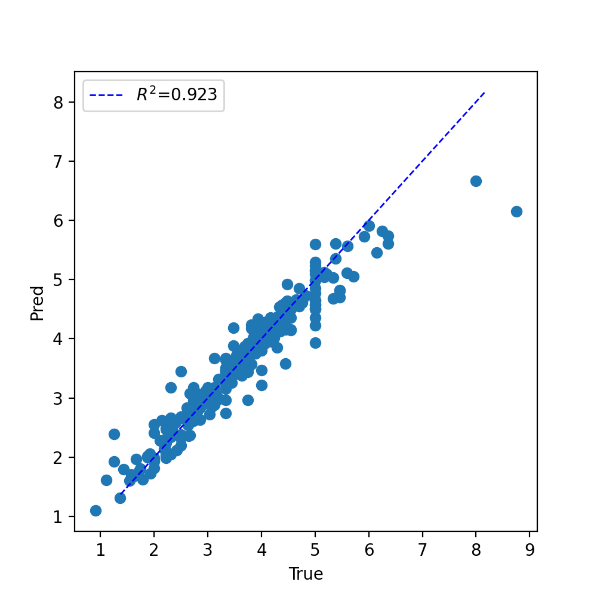
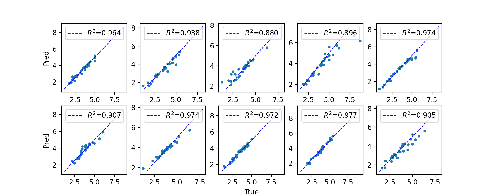

=============================================
 Evaluating a Network with Cross-Validation:
=============================================

This page walks-through a full example of using 10-fold cross-validation to validate that PARROT is training accurate and generalizeable networks. For the purposes of this example, we will use the "seq_regress_dataset.tsv" dataset found in the **/data** folder. For the purposes of this example, I'm going to be saving the networks and other output file to a folder named "/output".

**parrot-cvsplit**

First, let's generate the 10 different split-files using ``parrot-cvsplit``. Each of these split-files will specify a different 1/10th of the dataset to be the held-out test set. The remaining 9/10ths will be partitioned randomly into training and validation sets, 80:20.

.. code-block:: bash
    
    parrot-cvsplit data/seq_regress_dataset.tsv output/cv_example_splits -k 10 -t 0.8

This should generate 10 files in /output named cv_example_splits_cv[0-9].txt

**10-fold CV training**

Next, we want to iteratively train PARROT networks for each of these cross-validation folds using ``parrot-train``. We will manually specify which samples should belong in the training/val/test sets by using the ``--split`` flag in conjunction with the split-files we just generated. For this example, we are going to use the hyperparameters: ``-nl 2 -hs 15 -lr 0.001 -b 16`` and train for 250 epochs (these are relatively arbitrary decisions). It's important here to save the output prediction files under different names, so that we can go back and analyze all of them combined at the end of network training.

If you like, you can also use the ``--include-figs`` flag to assess how each of these networks perform individually. For this example, I did not include this flag because I will do analysis at the end using some external code.

.. code-block:: bash

    parrot-train datasets/seq_regress_dataset.tsv cv_test/network0.pt -d sequence -c 1 -nl 2 -hs 15 -lr 0.001 -b 16 -e 250 --split cv_test/cv_example_splits_cv0.txt 

    PARROT with user-specified parameters
    -------------------------------------
    Validation set loss per epoch:
    Epoch 0 Loss 3.4118
    Epoch 5 Loss 0.7524
    Epoch 10    Loss 0.7530
    .
    .
    .
    Epoch 235   Loss 0.1220
    Epoch 240   Loss 0.1229
    Epoch 245   Loss 0.1248

    Test Loss: 0.0335   

Now repeat this command 9 more times, for each of the cross-validation folds. I used the ``--silent`` flag to prevent additional output to terminal, but this is totally optional.

.. code-block:: bash

    parrot-train datasets/seq_regress_dataset.tsv cv_test/network1.pt -d sequence -c 1 -nl 2 -hs 15 -lr 0.001 -b 16 -e 250 --split cv_test/cv_example_splits_cv1.txt --silent
    parrot-train datasets/seq_regress_dataset.tsv cv_test/network2.pt -d sequence -c 1 -nl 2 -hs 15 -lr 0.001 -b 16 -e 250 --split cv_test/cv_example_splits_cv2.txt --silent
    .
    .
    .
    parrot-train datasets/seq_regress_dataset.tsv cv_test/network9.pt -d sequence -c 1 -nl 2 -hs 15 -lr 0.001 -b 16 -e 250 --split cv_test/cv_example_splits_cv9.txt --silent

All of this could also be accomplished using a wrapper shell script. In fact, for larger datasets this is recommended so that you don't have sit around and wait for the network to train each fold.
    
**Analyze CV predictions**

After running all of this, you should have 10 files with test set predictions: "network[0-9]_predictions.tsv". First, we will evaluate (using Pearson's R square)each set of predictions separately and see how the networks perform on average and how much variance there is between different networks. In published work that uses cross-validation, it's typical to report this average performance (by some metric) across CV folds and the variance between folds.

Since all of these networks perform well, and there is low variance between predictions, we can also combine each of these prediction files and see how the cumulative predictions fare:

There's a couple of outlier sequences, but overall it looks like our networks did great!

**Train final network**

Finally, now that we have a good estimate of how reliable our networks' predictions are, we can create a new network using *all* of our data (and training for longer for good measure!). To do this, we simply run ``parrot-train`` again while specifying a test set size of ~0 using the ``--set-fractions`` flag (we will use 0.01, since using 0 throws an error). Importantly, validation set CANNOT be zero, as this subset is critical for making sure we do not overfit our data.

.. code-block:: bash

    parrot-train datasets/seq_regress_dataset.tsv cv_test/final_cvnetwork.pt -d sequence -c 1 -nl 2 -hs 15 -lr 0.001 -b 16 -e 350 --set-fractions 0.79 0.2 0.01

Now if we want, we can use final_cvnetwork.pt to predict unlabeled sequences with ``parrot-predict``.
