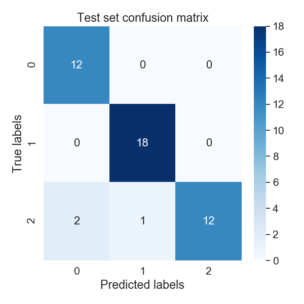
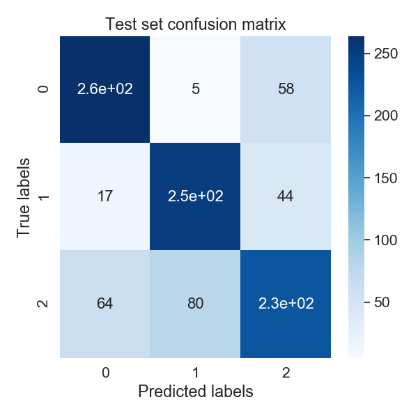
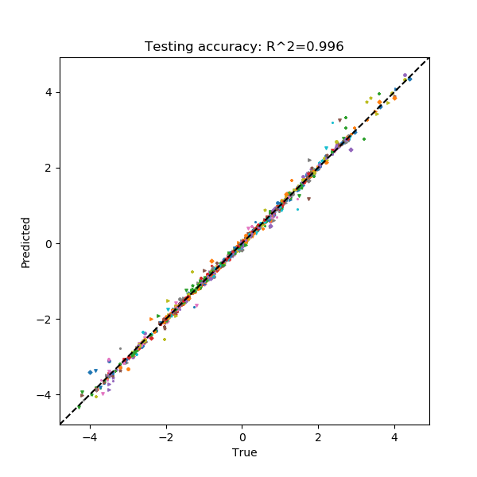

Examples
========

Below are a handful of examples outlining how PARROT can be used to train a BRNN on various machine learning tasks. Provided in the PARROT distribution is a the **data** folder which has 4 different example datasets corresponding to the possible combinations of data format (sequence-mapped values and residue-mapped values) and machine learning task (classification and regression). Details on these datasets can be found in the README within the **data** folder. This folder also contains an example list of sequences for ``parrot-predict``, and other files that are used in these examples.

parrot-train
------------

**Sequence classification:**
In our first example, each of the 300 sequences in *seq_class_dataset.tsv* belongs to one of three classes:

.. code-block::
	
	Frag0 WKHNPKHLRP 0
	Frag1 DLFQDEDDAEEEDFMDDIWDPDS 1
	Frag2 YHFAFTHMPALISQTSKYHYYSASMRG 2
	Frag3 CNRNRNHKLKKFKHKKMGVPRKKRKHWK 0
	.
	.
	.

Let's train a network with ``parrot-train`` that can identify the inherent pattern (described in data/README.md). For starters, let's try to train for 200 epochs on a network with 2 hidden layers, a hidden vector size of 5, a learning rate of 0.001 and a batch size of 32. Note that the paths for the dataset and output network may vary on different machines. Let's also use the ``-v`` flag to get a sense of training.

.. code-block::

	parrot-train datasets/seq_class_dataset.tsv output_dir/network.pt --datatype sequence -nc 3 -nl 2 -hs 5 -lr 0.001 -e 200 -b 32 -v

Training has a stochastic component, so running this multiple times may yield slightly different results. The output should look something like:

.. code-block::

	Epoch 0	Loss 0.0491
	Epoch 5	Loss 0.0486
	Epoch 10	Loss 0.0482
	.
	.
	.
	Epoch 190	Loss 0.0063
	Epoch 195	Loss 0.0063

	Test Loss: 0.1932
	
In **output_dir**, there should also be two PNG files describing the training process and network performance.

.. image:: ../images/train_test.png
  :width: 400

This gives us a general sense of how the network will perform on new data in the future. Overall the network performs well, and the only misclassifications are for sequences in class '2'.

**Sequence regression:**

Using PARROT on a machine learning regression task is very similar to classification. In *seq_regress_dataset.tsv*, instead of each sequence being assigned an integer class label, each sequence is represented by a real number.

.. code-block::

	Frag0 EHCWTYIFQMYRIDQTQRVKRGEKPIIYLEPMAR 3.8235294117647056
	Frag1 SDAWVMKFLWDKCGDHFIQYQKPANRWEWVD 3.870967741935484
	Frag2 IYPEQSPDNAWAW 3.076923076923077
	.
	.
	.

The only difference in the ``parrot-train`` command in this regression case (other than the datafile path) is the ``-nc`` argument. Since we are doing regression, we will put '1' here. We could also change the network hyperparameters, but for now let's just use the same as above. Notice that we are using a different output network name so as to not overwrite the previous network.

.. code-block::

	parrot-train datasets/seq_regress_dataset.tsv output_dir/network2.pt --datatype sequence -nc 1 -nl 2 -hs 5 -lr 0.001 -e 200 -b 32 -v

After this command, we see a similar output as before. In this case, in addition to ``train_test.png`` (this overwrites the previous image--if you are using the same output directory for lots of training, it may be wise to rename these files after each run) you will see a scatter plot detailing the predictions on the test set data.

.. image:: ../images/seq_scatter.png
  :width: 400

Not bad!

**Residue classification:**

Now let's try a task where the objective is to classify each residue in a sequence. Unlike before, in *res_class_dataset.tsv* there are multiple values per sequence in the datafile.

.. code-block::

	Frag0 DEDGTEDDMATTK 1 1 1 1 1 1 1 1 1 1 1 1 1
	Frag1 CGSAPSRFVKTCDPDEEDEDDEDE 2 2 2 2 2 2 2 2 2 2 2 2 2 2 1 1 1 1 1 1 1 1 1 1
	Frag2 EWYEDDKPFPCPERVPHHKKGHRGGWRAKKNWKV 1 1 1 1 1 1 1 0 2 2 2 2 2 2 2 2 2 0 0 0 0 0 0 0 0 0 0 0 0 0 0 0 0 0
	.
	.
	.

Despite this major difference, the ``parrot-train`` command is similar to the above examples. The only difference will be the value we input after the ``--datatype`` flag. Before we put 'sequence', and here we will put 'residues'. Just for fun, we will also switch up our number of layers (``-nl``) and hidden size (``-hs``) hyperparameters.

.. code-block::

	parrot-train datasets/res_class_dataset.tsv output_dir/network3.pt --datatype residues -nc 3 -nl 3 -hs 8 -lr 0.001 -e 200 -b 32 -v

This will save a confusion matrix 'res_CM.png' to the output directory. It's nearly identical to the confusion matrix for sequence classification, although in this case it is for every single residue in all of the sequences in the test set.

**Residue regression:**

The final kind of machine learning task that PARROT can handle is regression on every residue in a sequence. For this command ``--datatype`` should be set to 'residues' and ``-nc`` should be '1'. In this example I also changed the learning rate hyperparameter ``-lr``.

.. code-block::

	parrot-train prot-brnn/PARROT/data/res_regress_dataset.tsv saved_networks/example.pt --datatype residues -nc 1 -nl 3 -hs 8 -lr 0.005 -e 200 -b 32 -v

As in the other regression task, a residue regression task will produce a scatter plot that shows the network's performance on the test set. Each combination of marker shape and color in this scatterplot belong to a single sequence, which may provide some insight on whether the network systematically mis-predicts all sequences, or if there are only a few specific sequences that are outliers.

**Other flags:**

``--stop``:
This flag determines the stop condition for network training. Currently, there are two options implemented: either 'iter' or 'auto'. In all of the previous examples we used the default behavior, 'iter', which means that the number we specify for the ``-e`` flag will be the number of iterations that we train the network. Alternatively, using 'auto' means that training will stop automatically once performance on the validation set has plateaued for ``-e`` epochs. Thus, with 'auto' it is recommended to use a smaller number of epochs (5-15) for ``-e`` so training does not extend for a significantly long period of time.

.. code-block::

	parrot-train datasets/seq_regress_dataset.tsv output_dir/network.pt --datatype sequence -nc 1 -nl 2 -hs 5 -lr 0.001 -e 10 -b 32 -vv --stop auto

.. code-block::

	Epoch 0	Loss 0.1779
	Epoch 1	Loss 0.1752
	Epoch 2	Loss 0.1727
	...
	Epoch 98	Loss 0.0456
	Epoch 99	Loss 0.0456
	Epoch 100	Loss 0.0456
	Epoch 101	Loss 0.0456
	Epoch 102	Loss 0.0456
	Epoch 103	Loss 0.0456
	Epoch 104	Loss 0.0456
	Epoch 105	Loss 0.0456
	Epoch 106	Loss 0.0456
	Epoch 107	Loss 0.0456
	Epoch 108	Loss 0.0456
	Epoch 109	Loss 0.0456
	Epoch 110	Loss 0.0455
	Epoch 111	Loss 0.0455
	Epoch 112	Loss 0.0455

Training stops here because performance hasd stopped improving. Worth mentioning: in some cases such as this dataset, 'auto' can actually get stuck in a local minimum well before the network is fully trained. Be mindful of this when using 'auto' stop condition.

``--setFractions``:
This flag allows the user to set the proportions of data that will be a part of the training set, validation set, and test set. By default, the split is 70:15:15. This flag takes three input arguments, between 0 and 1, that must sum to 1.

.. code-block::

	parrot-train datasets/seq_regress_dataset.tsv output_dir/network.pt --datatype sequence -nc 1 -nl 2 -hs 5 -lr 0.001 -e 200 -b 32 -v --setFractions 0.5 0.4 0.1

Notice that the output graph from this command will have fewer datapoints because of the reduced test set. Most likely, the accuracy will be a little worse then the default proportions because the training set is also smaller.

``--split``:
This flag allows the user even greater control over the training set, validation set, and test set split of their input data. This flag requires an argument that is a path to a `split_file`, which specifically allocates sequences in `datafile` to the different datasets. An example `split_file` is provided in the /data folder for reference.

.. code-block::

	parrot-train datasets/seq_regress_dataset.tsv output_dir/network.pt --datatype sequence -nc 1 -nl 2 -hs 5 -lr 0.001 -e 200 -b 32 -v --split datasets/split_file.tsv 

``--excludeSeqID``:
Include this flag if your `datafile` is formatted without sequence IDs:

.. code-block::

	EHCWTYIFQMYRIDQTQRVKRGEKPIIYLEPMAR 3.8235294117647056
	SDAWVMKFLWDKCGDHFIQYQKPANRWEWVD 3.870967741935484
	IYPEQSPDNAWAW 3.076923076923077
	.
	.
	.

.. code-block::

	parrot-train datasets/seq_regress_dataset.tsv output_dir/network.pt --datatype sequence -nc 1 -nl 2 -hs 5 -lr 0.001 -e 200 -b 32 -v --excludeSeqID

parrot-optimize
---------------

``parrot-optimize`` will train a network like ``parrot-train``, however this command does not require the user to specify hyperparameters. Instead, it relies upon Bayesian Optimization to automatically select hyperparameters. Although Bayesian Optimization is much more efficient than grid search optimization, it still requires many iterations to converge upon the best hyperparameters. Additionally, this command relies upon 5-fold cross validation for each set of hyperparameters to achieve an accurate estimate of network performance. All together, this means that ``parrot-optimize`` can take over 400x longer to run than ``parrot-train``. It is strongly recommended to only run this command on a machine with a GPU.

Nonetheless, usage for ``parrot-optimize`` is remarkably similar to ``parrot-train``, since many of the flags are identical. As an example, let's run the command on a residue regression dataset:

.. code-block::

	parrot-optimize datasets/res_regress_dataset.tsv output_dir/cv_example.pt --datatype residues -nc 1 -e 200 -b 32 -vv

Notice how we do not need to specify number of layers, hidden vector size, or learning rate as these are the parameters we are optimizing. Perhaps the most important consideration is the number of epochs. Running the optimization procedure with a large number of epochs is more likely to identify the best performing hyperparameters, however more epochs also means significantly longer run time. It is recommended to play around with your data using ``parrot-train`` with a few different parameters and visualizing 'train_test.png'. Ideally, you should set the number of epochs to be around the point where validation accuracy tends to plateau during training.

Let's break down what is output to console during the optimization procedure:

.. code-block::

	[1/5] Loss: 75.247434
	[2/5] Loss: 75.689319
	[3/5] Loss: 66.811298
	[4/5] Loss: 72.030063
	.
	.
	.
	[3/5] Loss: 1.476518
	[4/5] Loss: 1.395311
	[5/5] Loss: 1.380726

	Initial search results:
	lr	nl	hs	output
	0.00001	 5	10	73.2288
	0.00100	 5	 5	8.7716
	1.00000	 8	20	66.9336
	0.00100	15	 5	52.8299
	0.00100	 3	30	1.4568
	Noise estimate: 3.285178370588926

The first chunk of text details the network performance (for all 5 data folds) during the initial stage of hyperparameter optimization. This stage is used to gather an estimate of the noise (standard deviation across cross-val folds) for future optimization.

.. code-block::

	Primary optimization:
	--------------------

	Learning rate   |   n_layers   |   hidden vector size
	=====================================================
	  0.000630	|      3       |         30
	[1/5] Loss: 1.881410
	[2/5] Loss: 2.010539
	[3/5] Loss: 1.651101
	[4/5] Loss: 1.631336
	[5/5] Loss: 3.060484
	.
	.
	.

	The optimal hyperparameters are:
	lr = 0.004901
	nl = 1
	hs = 29

This long block of text is the main process of optimization. The algorithm automatically selects the learning rate, number of layers and hidden vector size for each iteration. Finally, after the algorithm converges (max 75 iterations), the optimal hyperparameters are determined. These hyperparameters are also saved to a text file called 'optimal_hyperparams.txt' in the output directory.

.. code-block::

	Training with optimal hyperparams:
	Epoch 0	Loss 56.9641
	.
	.
	.

	Test Loss: 0.7732

Lastly, a network is trained on all the data using the optimal hyperparameters. Like in ``parrot-train`` two PNGs are saved to the output directory describing training and performance on the held-out test set.

parrot-predict
--------------

Use the trained network from optimize and predict on an list of sequences (example provided in /data folder). In this case we will make residue regression prediction using the network trained from ``parrot-optimize`` above. The most important thing to keep in mind when using ``parrot-predict`` is that your ``-nl`` and ``-hs`` hyperparameters (and encoding scheme) must exactly match those used for network training, or else you will get an error.

Using the example input file:

.. code-block::

	a1 EADDGLYWQQN
	b2 RRLKHEEDSTSTSTSTSTQ
	c3 YYYGGAFAFAGRM
	d4 GGIL
	e5 GREPCCMLLYILILAAAQRDESSSSST
	f6 PGDEADLGHRSLVWADD

.. code-block::

	parrot-predict datasets/seqfile.txt output_dir/cv_example.pt output_dir/seq_predictions.txt --datatype residues -nc 1 -nl 1 -hs 29

Running this command produces an output file with predictions:

.. code-block::

	a1 EADDGLYWQQN -1.220267 -1.7227852 -1.6810288 -2.4043236 -0.09417024 0.64092124 0.5456871 -1.8928833 -2.7887173 -3.6044078 -2.4574862
	b2 RRLKHEEDSTSTSTSTSTQ -3.7224112 -1.8503121 -1.5983793 -1.2008493 -3.5577574 -3.4514222 -3.5511665 -2.6457114 -1.7057183 -0.78130686 -0.7216715 -0.7898313 -0.70238614 -0.7789676 -0.7124919 -0.7318907 -0.7426094 -1.5785892 -1.572853
	c3 YYYGGAFAFAGRM -0.9441874 -1.3341192 -0.9653273 -0.69102514 0.32323557 1.4534209 2.1537614 2.429162 2.2840738 1.4165663 -0.881636 -1.2768524 -0.95433706
	d4 GGIL -0.5195379 1.1197864 2.240749 2.7807207
	e5 GREPCCMLLYILILAAAQRDESSSSST -2.0686545 -2.7998338 -3.2005563 -0.89753973 1.1320789 2.3304148 2.7493396 3.2426906 2.1906257 2.5232615 2.4606586 4.522563 4.0591545 3.4521952 2.415197 1.8450507 0.0069223046 -2.052992 -3.8073626 -3.8168678 -2.6170073 -1.7135364 -0.8026675 -0.7848917 -0.76005983 -0.73561 -0.6911867
	f6 PGDEADLGHRSLVWADD -1.0060852 -1.9269344 -2.5225387 -1.6895776 -1.7939533 0.6811078 0.026133358 -0.08126199 -2.7815032 -2.8138366 -0.3407705 2.483284 2.4456654 1.9606701 -0.705072 -1.9476694 -2.6707811
